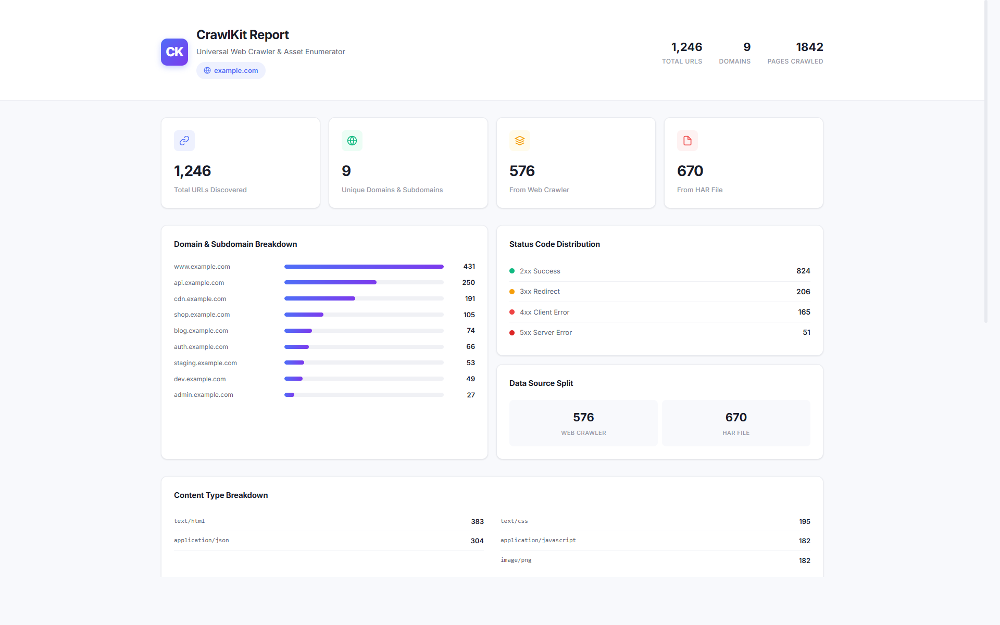

<div align="center">

```
   ___                    _ _  ___ _
  / __| _ __ _ __ __ __ | | |/ (_) |_
 | (__ | '__|/ _` |\ V  V /| | ' <| | __|
  \___||_|  \__,_| \_/\_/ |_|_|\_\_|\__|
```

### Universal Web Crawler & Asset Enumerator

[](https://python.org)
[](https://kali.org)
[](LICENSE)

**CrawlKit** is a powerful web crawler and asset enumerator for security professionals, created by **Vimal T**. Point it at any domain, feed it HAR files, and get comprehensive **Excel + HTML reports** with full URL enumeration.



</div>

---

## Features

- **Universal Crawling** — Works with any domain. Just give it a URL.
- **HAR File Analysis** — Parse browser-captured HAR files for deep URL extraction (AJAX, API calls, etc.)
- **Excel Reports** — 5-sheet XLSX: All URLs, Domain Summary, Source Breakdown, Status Codes, Content Types
- **Premium HTML Reports** — Beautiful white-theme reports with dashboard cards, searchable tables, domain charts
- **Deep Extraction** — Extracts from `<a>`, `<script>`, `<link>`, ``, `<iframe>` + JavaScript regex
- **BFS Crawling** — Breadth-first traversal with configurable rate limiting
- **Cross-Platform** — Works on Kali Linux, Ubuntu, Windows

---

## Installation

```bash
git clone https://github.com/vimalpaul/CrawlKit.git
cd CrawlKit
pip3 install -r requirements.txt
```

---

## Usage

### Basic Crawl

```bash
python crawlkit.py -u https://www.example.com
```

### Crawl + HAR File (recommended)

```bash
python crawlkit.py -u https://www.example.com -har www.example.com.har -m 2000 -o example_report
```

### HAR-Only Mode

```bash
python crawlkit.py -u https://target.com -har capture.har --skip-crawl
```

### Quick Scan

```bash
python crawlkit.py -u https://example.com -m 500 -d 0.1
```

---

## CLI Reference

| Flag | Short | Required | Default | Description |
|------|-------|----------|---------|-------------|
| `--url` | `-u` | Yes | — | Target URL to crawl |
| `--har` | `-har` | No | — | Path to HAR file |
| `--max-pages` | `-m` | No | `2000` | Max pages to crawl |
| `--output` | `-o` | No | `{domain}_crawlkit_report` | Output filename prefix |
| `--delay` | `-d` | No | `0.3` | Delay between requests (seconds) |
| `--skip-crawl` | — | No | `False` | Skip crawling, parse HAR only |
| `--version` | `-v` | No | — | Show version |

---

## 📊 Enterprise-Grade Reporting

CrawlKit doesn't just dump URLs into your terminal—it generates **beautiful, actionable reports** designed for security professionals, penetration testers, and bug bounty hunters to immediately start analyzing attack surfaces.

### 📈 Premium HTML Dashboard (`.html`)
A fully self-contained, offline-ready HTML report featuring a pristine white-theme design. 
- **Executive Summary:** High-level metrics (Total URLs, Unique Domains, Crawler vs. HAR).
- **Domain Distribution:** Gradient bar charts visualizing asset sprawl across subdomains.
- **Status & Content Analytics:** Color-coded distribution panels for status codes (2xx, 3xx, 404, 500) and content types.
- **Interactive Data Table:** A searchable, sortable, high-density URL table to instantly filter for `api`, `admin`, or `token` endpoints.

### 📗 Multi-Sheet Excel Report (`.xlsx`)
A comprehensive, data-rich spreadsheet designed for deep-dive filtering and integration with other tools.
- **All URLs:** The complete master list of every discovered asset with paths and query parameters.
- **Domain Summary:** Quickly identify misconfigured or forgotten subdomains.
- **Source Breakdown:** Compare assets found via the Python crawler vs. your browser's HAR traffic.
- **Status Codes:** Dedicated pivot-style sheet for rapid triage of broken links (404s) or server errors (500s).
- **Content Types:** Instantly isolate exposed JSON APIs, JavaScript chunks, or config files.

---

## How It Works

```
1. Web Crawler (BFS)
   - Follow <a>, <link>, <script> tags
   - Extract , <iframe> URLs
   - Regex scan JavaScript for URLs

2. HAR File Parser
   - Parse HTTP Archive JSON
   - Extract all network requests
   - Filter by target domain

3. Report Generation
   - Excel (.xlsx) — 5 sheets
   - HTML (.html) — Premium report
```

---

## How to Capture a HAR File

1. Open Chrome → Press F12 → Go to **Network** tab
2. Browse the target website (click around!)
3. Right-click in the Network panel → **Save all as HAR with content**
4. Feed it to CrawlKit with `-har filename.har`

---

## License

MIT License — do whatever you want with it.

---

<div align="center">

**Built for Kali Linux** | **Made with Python** | **Author: Vimal T**

</div>
